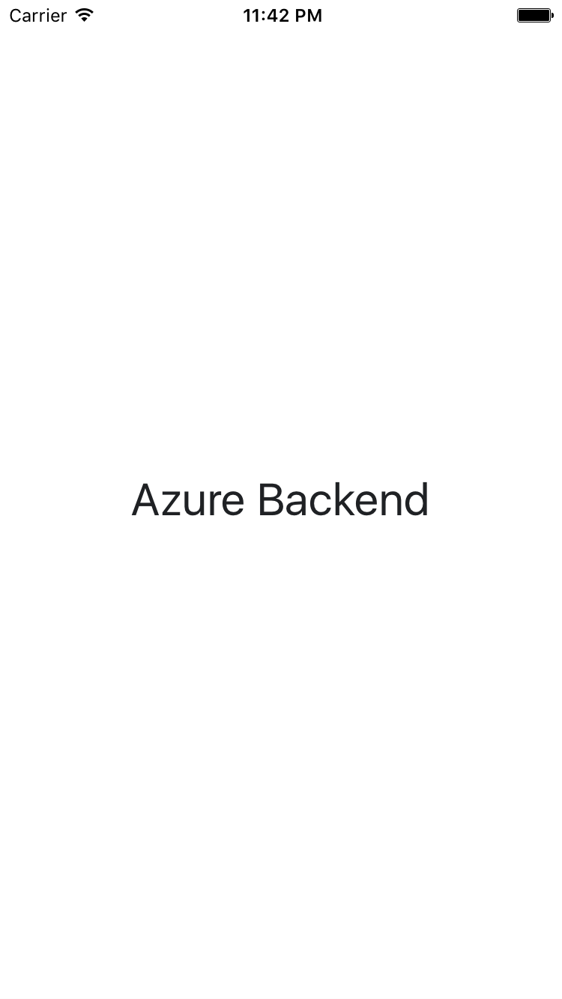

#Introduction
This repository is a project example of a simple login and registration mobile app made using Xamarin and Azure as its backend. It contains a splash, login, register and home page view. It also caters the functions of what you will expect in a login and register feature in a mobile application.

#Technology
The project is created using the following technologies:
* Xamarin.iOS
* Azure Easy Tables
* Azure Mobile Client SDK
* Azure Mobile SQLiteStore
* App Service Helpers

#Preview
###Demo
[Azure Backend Login/Register Mobile App](https://www.youtube.com/watch?v=lJsjLW3svXc)

###Screenshots

#Contest
This project was created as a participation to Xamarin's contest, *"Add an Azure Backend to Your Mobile App"*, to win a Xamarin t-shirt! Read the full contest description [here](https://blog.xamarin.com/contest-add-an-azure-backend-to-your-mobile-app/?utm_medium=social&utm_campaign=blog&utm_source=twitter&utm_content=azure-tshirt-sweepstakes).

###Rules
>All submissions must be made by **Monday, July 25 at 12 pm EST**. A valid entry consists of a tweet containing the hashtags #Xamarin **AND** #AzureMobile, along with a short video clip of your app connecting to an Azure Mobile Apps backend. A valid entry will win one Xamarin t-shirt. Limit one entry per person. To be eligible, you must follow [@XamarinHQ](https://twitter.com/xamarinhq) to enable us to DM you for private follow up. Please allow up to three weeks for us to verify entries and collect shipping information to send your Xamarin t-shirt. There is no purchase necessary to enter the “Add an Azure Backend To Your Mobile App” contest.

###Submission
<blockquote class="twitter-tweet" data-lang="en">
Simple Login/Register. It&#39;s my first time using Azure and adding backend was so easy. 
<a href="https://twitter.com/hashtag/Xamarin?src=hash">#Xamarin</a>
<a href="https://twitter.com/hashtag/AzureMobile?src=hash">#AzureMobile</a> 
<a href="https://t.co/lIu6jLV7TX">https://t.co/lIu6jLV7TX</a>
&mdash; Amir Fahd Hadji Usop (@amirfahd72)
<a href="https://twitter.com/amirfahd72/status/755766233270628353">July 20, 2016</a></blockquote>

###Tasks
* [ ] Add loading progress indicator
* [ ] Customize splash screen view
* [ ] Improve UI theme and styling
* [ ] Create an Android version
